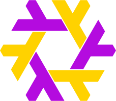

<!-- markdownlint-disable -->

  

  <table>
    <tr>
      <td>
        
      </td>
      <td>
        
      </td>
    </tr>
    <tr>
      <td align="center">
        
      </td>
      <td>
        
      </td>
    </tr>
  </table>

Please note that my technical competency fluctuates based on my active projects. I learn (and often forget) things as I go, and regularly rotate between different problem areas.  
On occasions I've worked with as many as 8 different languages in a single day.  

<table>
<thead>
<tr>
<th>Languages</th><th>Frameworks & Libraries</th><th>Tools</th>
</tr>
</thead>
<tbody>
<tr>
<td colspan="3" align="center"><b>Actively Using</b></td>
</tr>
<tr>
<td align='center'>
<!-- Nix Language -->

<!-- Rust -->

<!-- Sway -->

<!-- Bash -->

<!-- Emacs Lisp -->

<!-- TypeScript -->

<!-- Org mode -->

<!-- LaTeX -->

<!-- LikeC4 -->

<!-- KDL -->

<!-- HTML -->

<!-- Tailwind CSS -->

</td>
<td align='center'>
<!-- Kubenix -->

<!-- Devenv -->

<!-- Loco.rs -->

<!-- Ratatui -->

<!-- Dioxus -->

<!-- Pulumi -->

<!-- Deno -->

<!-- Nest.js -->

<!-- XState -->

<!-- PostgreSQL -->

<!-- Drizzle -->

<!-- GraphQL -->

<!-- Payload CMS -->

<!-- React Router 7 -->

<!-- WXT -->

<!-- Sli.dev -->

<!-- React -->

<!-- Storybook -->

<!-- Serenity.js Screenplay Pattern -->

<!-- Playwright -->

<!-- Vitest -->

</td>
<td align='center'>
<!-- FreeBSD Unix -->

<!-- NixOS -->

<!-- GNU/Linux -->

<!-- Arch Linux -->

<!-- Doom Emacs -->

<!-- Git -->

<!-- Kubernetes -->

<!-- Docker -->

<!-- Trunk-Based Development -->

<!-- Zellij -->

<!-- Nx -->

<!-- Supabase -->

<!-- GitHub Actions -->

<!-- Vercel -->

<!-- Netlify -->

<!-- Fuel SDKs -->

<!-- Penpot -->

</td>
</tr>
<tr>
<td colspan="3" align="center"><b>Previously Used</b></td>
</tr>
<tr>
<td align='center'>
<!-- Embedded C -->

<!-- C++ -->

<!-- Arduino -->

<!-- Java -->

<!-- Python -->

<!-- JavaScript -->

<!-- Svelte -->

<!-- Lua -->

<!-- CSS -->

</td>
<td align='center'>
<!-- Node.js -->

<!-- Express -->

<!-- Next.js -->

<!-- Remix.js -->

<!-- Astro -->

<!-- SvelteKit -->

<!-- Ember.js -->

<!-- Framer Motion -->

<!-- Jest -->

<!-- Chai -->

<!-- Mocha -->

<!-- PyTest -->

</td>
<td align='center'>
<!-- Oracle Enterprise Linux -->

<!-- Ubuntu -->

<!-- NeoVim -->

<!-- Vim -->

<!-- VS Code -->

<!-- Tmux -->

<!-- Jira -->

<!-- BitBucket -->

<!-- Confluence -->

<!-- Azure DevOps -->

<!-- Sanity -->

<!-- Figma -->

</td>
</tr>
<tr>
<td colspan="3" align="center"><b>Intend to Use in Future</b></td>
</tr>
<tr>
<td align='center'>
<!-- SPARK -->

<!-- Embedded Rust -->

<!-- Smalltalk -->

<!-- Solidity -->

<!-- Go -->

<!-- Ruby -->

<!-- Haskell -->

</td>
<td align='center'>
<!-- Qiskit -->

<!-- Ruby on Rails -->

<!-- Integrated Haskell Platform -->

<!-- NestJS TRPC -->

<!-- Analog.js -->

<!-- Angular -->

<!-- Spring Boot -->

<!-- PyTorch -->

</td>
<td align='center'>
<!-- seL4 -->

<!-- Bazel -->

<!-- Blocktorch -->

<!-- Kafka -->

<!-- Redis -->

<!-- AWS -->

<!-- Pharo -->

</td>
</tr>
</tbody>
</table>

## 🛠 Current Setup

<strong><a href="https://archlinux.org/">Arch Linux</a> - Migrating to <a href="https://nixos.org">NixOS</a>  </strong>

#### [Hyprland](https://hyprland.org/) compositor + [HyDE](https://github.com/prasanthrangan/hyprdots) configurator

|  |  |  |
|-|-|-|
|  |  |  |
|  |  |  |
|  |  |  |

<strong><a href="https://github.com/doomemacs/doomemacs">Doom Emacs</a> + <a href="https://github.com/emacs-evil/evil">Evil Mode</a>  </strong>

  <h3>See More</h3>

<table>
  <tr>
    <td width="50%">
<ul>
  <li>
    <a href="https://github.com/abo-abo/ace-window">ace-window</a> for window management
  </li>
  <li>
    <a href="https://github.com/alexluigit/dirvish">Dirvish</a> for file browsing
  </li>
  <li>
    <a href="https://github.com/emacsmirror/vterm">vterm</a> for split/full terminals
  </li>
  <li>
    <a href="https://emarsden.github.io/pgmacs/">pgmacs</a> for database queries
  </li>
</ul>
    </td>
    <td width="50%">
      <a href="https://emacs-tree-sitter.github.io/">tree-sitter</a> and
      <a href="https://emacs-lsp.github.io/lsp-mode/">lsp-mode</a> for
      syntax highlighting, structural editing, definition lookup, symbol navigation, intellisense, diagnostics etc.
    </td>
  </tr>
  <tr>
    <td></td>
    <td></td>
  </tr>
  <tr>
    <td width="50%">
      <a href="https://github.com/s-kostyaev/ellama">Ellama</a> +
      <a href="https://github.com/chep/copilot-chat.el">copilot-chat</a> for AI input and code review
    </td>
    <td width="50%">
      <a href="https://emacs-lsp.github.io/dap-mode/">dap-mode</a> for bug hunting 🐞
    </td>
  </tr>
  <tr>
    <td></td>
    <td></td>
  </tr>
  <tr>
    <td width="50%">
      <a href="https://github.com/astoff/devdocs.el">devdocs.el</a> for quick references
    </td>
    <td width="50%">
      <a href="https://github.com/pashky/restclient.el">restclient-mode</a> to ping API endpoints
    </td>
  </tr>
  <tr>
    <td></td>
    <td></td>
  </tr>
  <tr>
    <td width="50%">
      <a href="https://github.com/rajasegar/pnpm-mode">pnpm-mode</a> for running tasks
    </td>
    <td width="50%">
      <a href="https://magit.vc/">Magit</a> for Git client
    </td>
  </tr>
  <tr>
    <td></td>
    <td></td>
  </tr>
  <tr>
    <td width="50%">
      <a href="https://github.com/minad/vertico">Vertico</a> +
      <a href="https://github.com/minad/corfu">corfu</a> for fuzzy finding
    </td>
    <td width="50%">
      <a href="https://github.com/openscad/emacs-scad-mode">scad-mode</a> for 3D modelling
    </td>
  </tr>
  <tr>
    <td></td>
     <td></td>
  </tr>
  <tr>
    <td width="50%">
      <a href="https://orgmode.org/">org-mode</a> for notes
    </td>
    <td width="50%">
      <a href="https://www.gnu.org/software/emacs/manual/html_mono/eww.html">eww</a> for web browsing
    </td>
  </tr>
  <tr>
    <td></td>
<td></td>
  </tr>
  <tr>
    <td width="50%">
        <a href="https://pdftools.wiki/">pdf-tools</a> for pdf documents
    </td>
    <td width="50%">
      <a href="https://github.com/johanvts/emacs-fireplace">fireplace</a> for philosophical discussions
    </td>
  </tr>
  <tr>
    <td></td>
<td></td>
  </tr>
</table>

#### Previously on [Neovim](https://neovim.io) + [LazyVim](https://www.lazyvim.org/)

 

  <h3>See More</h3>

<table>
  <tr>
    <td width="50%">
<ul>
  <li>
    <a href="https://github.com/folke/edgy.nvim">Edgy</a> for window management
  </li>
  <li>
    <a href="https://github.com/nvim-neo-tree/neo-tree.nvim">Neotree</a> for file browsing
  </li>
  <li>
    <a href="https://github.com/akinsho/toggleterm.nvim">Toggleterm</a> for split/floating terminals
  </li>
  <li>
    <a href="https://github.com/tpope/vim-dadbod">Dadbod</a> for database queries
  </li>
</ul>
    </td>
    <td width="50%">
      <a href="https://github.com/stevearc/aerial.nvim">Aerial</a> and
      <a href="https://github.com/hedyhli/outline.nvim">Outline</a> for
      <a href="https://github.com/nvim-treesitter/nvim-treesitter">Treesitter Language Server Protocol</a> symbol navigation
    </td>
  </tr>
  <tr>
    <td></td>
    <td></td>
  </tr>
  <tr>
    <td width="50%">
      <a href="https://codeium.com/">Codeium</a> +
      <a href="https://github.com/features/copilot">GitHub Copilot</a> for AI input and code review
    </td>
    <td width="50%">
      <a href="https://github.com/mfussenegger/nvim-dap">Nvim DAP</a> for bug hunting 🐞
    </td>
  </tr>
  <tr>
    <td></td>
    <td></td>
  </tr>
  <tr>
    <td width="50%">
      <a href="https://github.com/nvim-neotest/neotest">Neotest</a> for running test suites
    </td>
    <td width="50%">
      <a href="https://github.com/rest-nvim/rest.nvim">Rest</a> to ping API endpoints
    </td>
  </tr>
  <tr>
    <td></td>
    <td></td>
  </tr>
  <tr>
    <td width="50%">
      <a href="https://github.com/stevearc/overseer.nvim">Overseer</a> for running tasks
    </td>
    <td width="50%">
      <a href="https://github.com/jesseduffield/lazygit">Lazygit</a> for Git client
    </td>
  </tr>
  <tr>
    <td></td>
    <td></td>
  </tr>
  <tr>
    <td width="50%">
      <a href="https://github.com/nvim-telescope/telescope.nvim">Telescope</a> +
      <a href="https://github.com/junegunn/fzf">fzf</a> for fuzzy finding
    </td>
    <td width="50%">
      <a href="https://github.com/brookhong/Surfingkeys">SurfingKeys</a> for browser navigation
    </td>
  </tr>
  <tr>
    <td></td>
    <td></td>
  </tr>
</table>

### [Ferris Sweep](https://github.com/davidphilipbarr/Sweep) + Gear Shifting

#### Previously on [Piantor](https://github.com/beekeeb/piantor)

  <h3>See More</h3>

|||
|-|-|
|  |   |

#### Started out on [Keebio Iris Rev. 5](https://docs.keeb.io/iris-rev3-build-guide)

 

 

<!-- markdownlint-disable -->

<b>✨ About Me</b>
  

- 🌱 Began self-taught developer journey in January 2023.
- ✋ Open-source software advocate, curious process miner, and craftsperson 🎨
- 💻 Passionate Vim/Neovim/Emacs & Operating Systems enthusiast.
- 🛠️ I believe that a good developer experience is key to a good user experience, and regularly explore paradigms that reduce fatigue and improve productivity 🏃‍♂️💨

<b>📖 Books</b>
  

Got a suggestion? Add it to the list :)

<table>
  <thead>
    <tr>
      <th>📚</th>
      <th>🙇</th>
      <th>✅</th>
    </tr>
  </thead>
  <tbody>
    <tr>
      <td style="text-align: center;">
        
        
      </td>
      <td style="text-align: center;">
        
        
        
        
      </td>
      <td style="text-align: center;">
        
       
        
        
      </td>
    </tr>
  </tbody>
</table>

<!-- markdownlint-disable -->

## 🔗 **Connect**:

 

---

Generated dynamically using [Rust](https://github.com/MFarabi619/MFarabi619/blob/main/apps/readme/src/main.rs) parser executed on a self-hosted [GitHub Actions](https://github.com/MFarabi619/MFarabi619/actions) runner 🦀🤖
