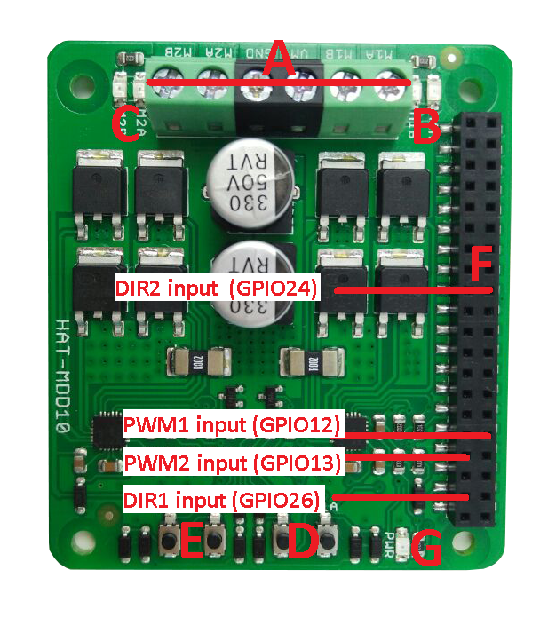
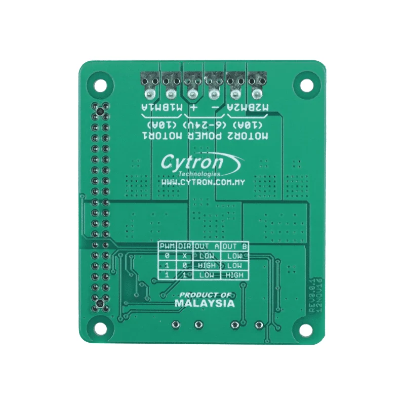
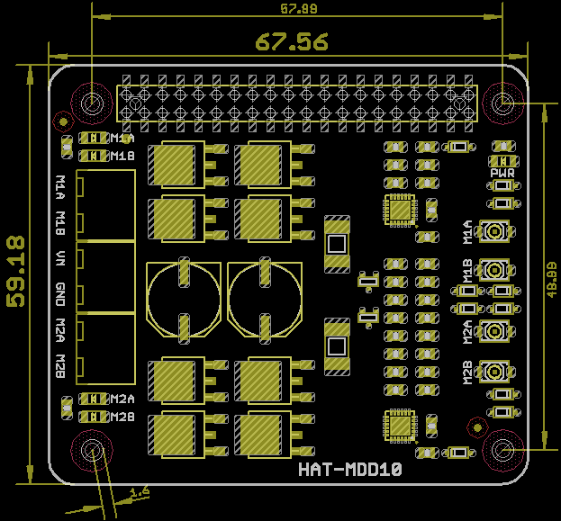
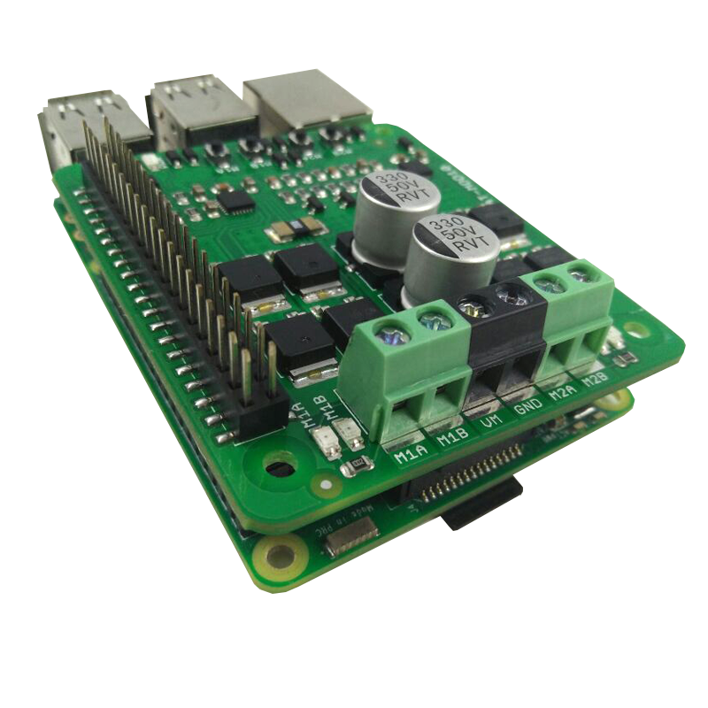

#+title: [[https://www.cytron.io/p-hat-mdd10][Cytron HAT-MDD10]]
#+author: Mumtahin Farabi
#+startup: indent showall inlineimages
#+options: toc:nil num:nil

#+attr_org: :width 700

| Label | Component               | Driver                  |
|-------+-------------------------+-------------------------|
| A     | Motor terminal block    | M1A/M1B/VM/GND/M2A/M2B  |
| B     | Motor 1 LED (A side)    |                         |
| C     | Motor 2 LED (A side)    |                         |
| D     | Motor 1 test switch     |                         |
| E     | Motor 2 test switch     |                         |
| F     | Raspberry Pi connector  | 40-pin PC104            |
| G     | Power LED               |                         |
| H     | PWM1 input              | ~AN1~ → ~GPIO12~         |
| I     | DIR1 input              | ~DIG1~ → ~GPIO26~        |
| J     | PWM2 input              | ~AN2~ → ~GPIO13~         |
| K     | DIR2 input              | ~DIG2~ → ~GPIO24~        |

-----

*Driver mapping.* [[file:../robot/hat_mdd10sm.py][=robot/hat_mdd10sm.py=]] identifiers ↔ vendor labels ↔ RPi BCM GPIOs:

| Code   | Board    | RPi BCM  | Function            |
|--------+----------+----------+---------------------|
| ~AN1~  | H / PWM1 | ~GPIO12~ | Motor 1 speed (PWM) |
| ~DIG1~ | I / DIR1 | ~GPIO26~ | Motor 1 direction   |
| ~AN2~  | J / PWM2 | ~GPIO13~ | Motor 2 speed (PWM) |
| ~DIG2~ | K / DIR2 | ~GPIO24~ | Motor 2 direction   |

Vendor uses =PWM1/PWM2/DIR1/DIR2=; we use =AN1/AN2/DIG1/DIG2=. When
grepping the datasheet, expect =PWM/DIR=.

-----

*Terminal block (label A).*

| Pin | Function                        |
|-----+---------------------------------|
| M1A | Motor 1 — terminal A            |
| M1B | Motor 1 — terminal B            |
| VM  | Motor supply (6–24 V, max 30 A) |
| GND | Common ground                   |
| M2A | Motor 2 — terminal A            |
| M2B | Motor 2 — terminal B            |

VM/GND feed both channels. Logic 3.3 V comes from the Pi over the 40-pin
header — *no separate logic supply needed*.

-----

*Truth table.*

| PWM  | DIR        | Output A | Output B | Effect                  |
|------+------------+----------+----------+-------------------------|
| Low  | don't care | Low      | Low      | Coast (motor off)       |
| High | Low        | High     | Low      | Drive A → B (one way)   |
| High | High       | Low      | High     | Drive B → A (other way) |

Same table is silkscreened on the back:

#+attr_org: :width 250 :align center

-----

*PWM modes.*

/Sign-magnitude (ours)./ Two distinct signals per channel: square-wave
PWM on ~ANx~ for speed, static high/low on ~DIGx~ for direction.
Direction transitions are clean. See ~HatMDD10SM.on_cmd_vel~ for the
duty-cycle mapping from ~/cmd_vel~.

/Locked-antiphase./ ~ANx~ tied permanently high (driver enable), ~DIGx~
driven with PWM. 50 % duty → stop; < 50 % → one direction; > 50 % →
other. Useful when PWM peripherals are scarce. *We don't use this mode.*

-----

*Indicators & test buttons.*

| Label | Component   | Behavior                                                     |
|-------+-------------+--------------------------------------------------------------|
| B, C  | LED A-side  | Lit when output A high, B low — current A → B                |
| B, C  | LED B-side  | Lit when output B high, A low — current B → A                |
| G     | Power LED   | On whenever VM is present                                    |
| D, E  | Test button | Drives the H-bridge directly while pressed — bypasses the Pi |

The test buttons let you confirm wiring + supply + bridge work without
involving the Pi — useful for first bring-up.

-----

*Electrical limits.* Absolute maximums — exceed and you damage the
board.

| #  | Parameter                            | Min | Typ | Max | Unit |
|----+--------------------------------------+-----+-----+-----+------|
|  1 | Motor supply voltage (~VM~)          |   6 |  –  |  24 | V    |
|  2 | Continuous motor current per channel |  –  |  –  |  10 | A    |
|  3 | Peak motor current[fn:1]             |  –  |  –  |  30 | A    |
|  4 | Logic input — high level             | 3.0 |  –  | 5.5 | V    |
|  5 | Logic input — low level              | 0.0 | 0   | 0.5 | V    |
|  6 | PWM frequency[fn:2]                  |  –  |  –  |  20 | kHz  |

[fn:1] No more than 10 seconds; vendor spec at 25 °C ambient.

[fn:2] Output frequency matches input frequency one-to-one.

-----

*Mechanical.* 67.5 × 59 mm. 3D models alongside:
[[file:cytron-hat-mdd10.step][=.step=]], [[file:cytron-hat-mdd10.f3d][=.f3d=]] (Fusion 360 source).

#+attr_org: :width 450 :align center

-----

*Wiring example.*

#+attr_org: :width 600 :align center

